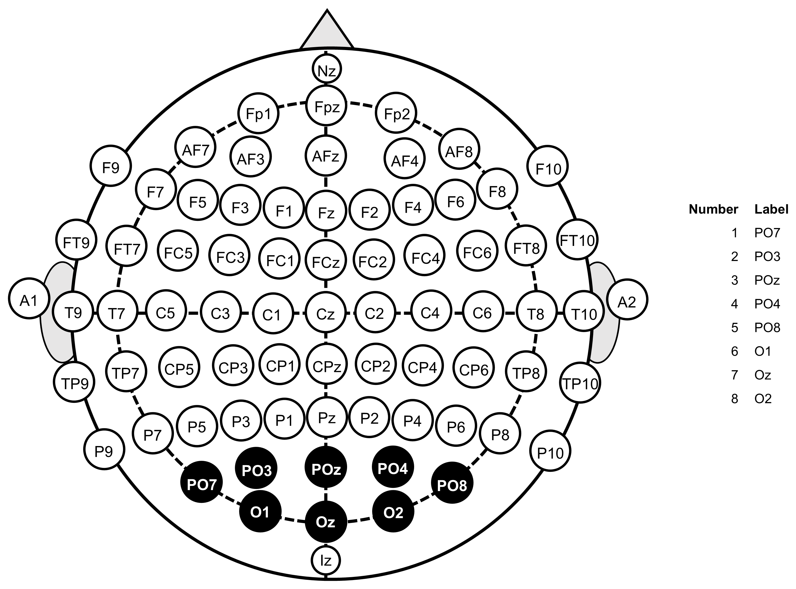

> Develop a visual intuition for the SSVEP response — first as a pattern across electrodes, then as a peak in the spectrum, then as four distinguishable peaks across the four stimulation classes. Purely exploratory: no preprocessing, no features, no classifier yet.

## A note on the example file

The book's running example is `subject_2_fvep_led_training_2.mat` — the cleanest of the four sessions for downstream work. This chapter is the one exception: it uses `subject_1_fvep_led_training_1.mat` instead, and it's worth saying why.

The four stimulation frequencies (9, 10, 12, 15 Hz) overlap with the alpha rhythm (8–12 Hz), a strong natural occipital oscillation that's there whether or not the LED is flickering. In raw, unfiltered PSDs that means the peak we *want* to see (the SSVEP at the stim frequency) competes with the peak we don't (alpha at ~10 Hz). On the running file, alpha wins on most classes — the 12 Hz class on Oz, for example, has alpha twice as tall as the stim peak. A "see the SSVEP peak" demo on that file would mostly show alpha.

`subject_1_fvep_led_training_1.mat` shows the SSVEP rising above alpha on Oz for every class, so the raw-data demos work visually. The file does have the broken LDA (CH11 stuck on class 3) flagged in Ch 1 — irrelevant here, since this chapter doesn't use CH11. The running example resumes from Ch 3 onward, once filtering takes alpha out of the picture.

## Where the electrodes sit

{#fig-montage width=60%}

The eight EEG channels (PO7, PO3, POz, PO4, PO8, O1, Oz, O2) cluster over visual cortex (V1/V2). SSVEP is generated there because that's where flicker-driven oscillations originate — the montage is purpose-built for SSVEP, not a generic EEG cap.

## The signal across the 8 occipital electrodes

```{python}
from pathlib import Path
import numpy as np
import scipy.io
import matplotlib.pyplot as plt
from scipy.signal import welch

DATA_DIR = Path("data")
EEG_LABELS = ["PO7", "PO3", "POz", "PO4", "PO8", "O1", "Oz", "O2"]
OZ = 7  # zero-indexed: y[7] is CH8 = Oz

mat = scipy.io.loadmat(DATA_DIR / "subject_1_fvep_led_training_1.mat")
fs = int(mat["fs"][0, 0])
y = mat["y"]


def find_trials(y):
    """Return [(start_idx, end_idx, freq_hz), ...] from CH10 transitions."""
    ch10 = y[9].astype(int)
    active = (ch10 != 0).astype(int)
    diff = np.diff(active)
    starts = np.where(diff == 1)[0] + 1
    ends = np.where(diff == -1)[0] + 1
    return [(s, e, int(ch10[s])) for s, e in zip(starts, ends)]


trials = find_trials(y)
print(f"{len(trials)} trials, durations {sorted({round((e-s)/fs, 2) for s,e,_ in trials})} s")
print(f"Class counts: {dict(sorted({f: sum(1 for _,_,fr in trials if fr==f) for _,_,f in trials}.items()))}")
```

Single-trial PSDs are noisy — not every trial shows the SSVEP equally clearly. For the demos in this chapter we pick the single trial with the strongest Oz response at its stimulation frequency, so the patterns we're trying to point at are visible. Block 3 will show the per-class averages, where the peaks emerge robustly across all five trials of each class.

```{python}
def oz_power_at_stim(trial):
    s, e, fr = trial
    ff, pxx = welch(y[OZ, s:e], fs=fs, nperseg=min(1024, e - s))
    return pxx[np.argmin(np.abs(ff - fr))]


demo_trial = max(trials, key=oz_power_at_stim)
s, e, f_hz = demo_trial
print(f"Demo trial: {f_hz} Hz, t = {s / fs:.1f}–{e / fs:.1f} s")
```

```{python}
#| label: fig-channels-trial
#| fig-cap: "Eight occipital channels during one stimulation trial."
t = np.arange(s, e) / fs

fig, axes = plt.subplots(8, 1, figsize=(12, 9), sharex=True)
for i, ax in enumerate(axes):
    ax.plot(t, y[i + 1, s:e], lw=0.5)
    ax.set_ylabel(EEG_LABELS[i], fontsize=9, rotation=0, ha="right", va="center")
    ax.set_ylim(-50, 50)
    ax.tick_params(labelsize=7)
axes[-1].set_xlabel("Time (s)")
fig.suptitle(f"Demo trial: {f_hz} Hz stimulation, {(e - s) / fs:.2f} s", fontsize=10)
fig.tight_layout()
fig.savefig("images/02-ssvep-signature_channels.png", dpi=200, bbox_inches="tight")
plt.show()
```

All eight channels show rhythmic activity during the trial — the raw EEG isn't dramatically different from rest at a glance, but the pattern *is* there. The channels are clearly correlated; PO3/POz/PO4 in the middle show the largest swings. Going from time domain to frequency domain is what makes the SSVEP unmistakable — that's the next plot.

## Seeing the peak — Welch PSD on Oz

```{python}
#| label: fig-psd-single-trial
#| fig-cap: "Welch PSD on Oz for the same trial. Dashed lines mark the stimulation frequency *f* and its second harmonic 2*f*."
ff, pxx = welch(y[OZ, s:e], fs=fs, nperseg=min(1024, e - s))

fig, ax = plt.subplots(figsize=(10, 4))
ax.plot(ff, pxx, lw=1.2)
ax.axvline(f_hz, color="C3", ls="--", alpha=0.7, label=f"f = {f_hz} Hz")
ax.axvline(2 * f_hz, color="C1", ls="--", alpha=0.7, label=f"2f = {2 * f_hz} Hz")
ax.set_xlim(0, 50)
ax.set_xlabel("Frequency (Hz)")
ax.set_ylabel("Power")
ax.set_title(f"Oz, single trial ({f_hz} Hz stimulation)")
ax.legend()
fig.tight_layout()
fig.savefig("images/02-ssvep-signature_psd.png", dpi=200, bbox_inches="tight")
plt.show()
```

There it is: a sharp peak at *f* — phase-locked, narrowband response from visual cortex to the periodic LED. The second harmonic at 2*f* is also visible and sometimes nearly as tall, because SSVEP responses aren't perfectly sinusoidal — the visual cortex puts energy into harmonics too.

The other peaks aren't SSVEP. The tall spike below 1 Hz is baseline drift — slow electrode polarization, breathing, sweat — amplified by the 1/f power law that EEG follows, which is why DC always wins on raw spectra. The bumps at 2–3 Hz are mostly eye-movement and blink artifacts capacitively coupling into the occipital electrodes; the small bump near 10 Hz is the natural alpha rhythm. All three are present in the rest period before this trial too, at similar or larger amplitude — they have nothing to do with the LED. Removing them is the job of Ch 3 (filtering); for now the point is to *see* what's actually in raw data, SSVEP and noise side by side.

Without the SSVEP peak the BCI has nothing to classify — everything in later chapters is built on it.

## Four classes, four peaks

```{python}
#| label: fig-psd-four-classes
#| fig-cap: "Average PSD on Oz, one curve per stimulation class. Dashed verticals mark the four stimulation frequencies."

fig, ax = plt.subplots(figsize=(11, 5))
colors = {9: "C0", 10: "C1", 12: "C2", 15: "C3"}
for target_f in [9, 10, 12, 15]:
    psds = []
    for s_i, e_i, fr in trials:
        if fr == target_f:
            ff, pxx = welch(y[OZ, s_i:e_i], fs=fs, nperseg=min(1024, e_i - s_i))
            psds.append(pxx)
    avg = np.mean(psds, axis=0)
    ax.plot(ff, avg, label=f"{target_f} Hz", color=colors[target_f], lw=1.4)
    ax.axvline(target_f, color=colors[target_f], ls="--", alpha=0.3)

ax.set_xlim(5, 35)
ax.set_xlabel("Frequency (Hz)")
ax.set_ylabel("Power")
ax.set_title("Oz, average PSD across 5 trials per class")
ax.legend(title="Stim freq")
fig.tight_layout()
fig.savefig("images/02-ssvep-signature_classes.png", dpi=200, bbox_inches="tight")
plt.show()
```

Each class lights up where it should: 9 Hz peaks at 9, 15 Hz peaks at 15, and where the fundamental brushes alpha — 10 and 12 Hz — the second harmonic at 20 and 24 Hz takes over as the dominant feature. That's a useful preview: a classifier doesn't have to bet on the fundamental alone. The four frequencies were chosen so no two classes share a low-order harmonic and so the highest still leaves Nyquist headroom (fs = 256 Hz, 4× the highest stim freq), which keeps the spectrum non-overlapping enough that simple peak-reading is plausible. We come back to this in Ch 5 (features) and Ch 7 (classification).
