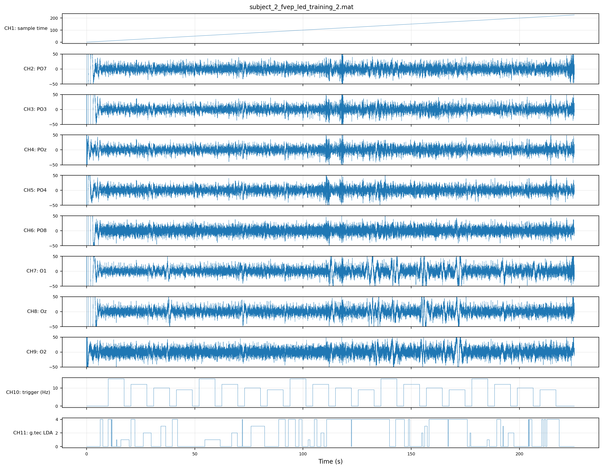
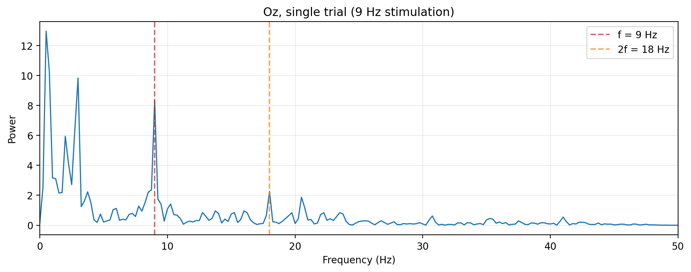
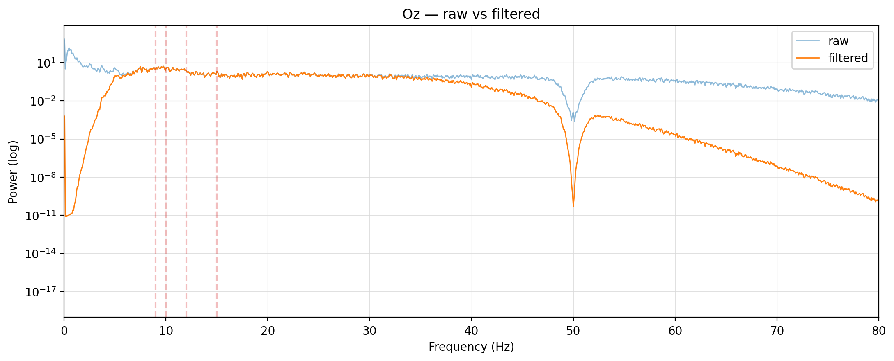
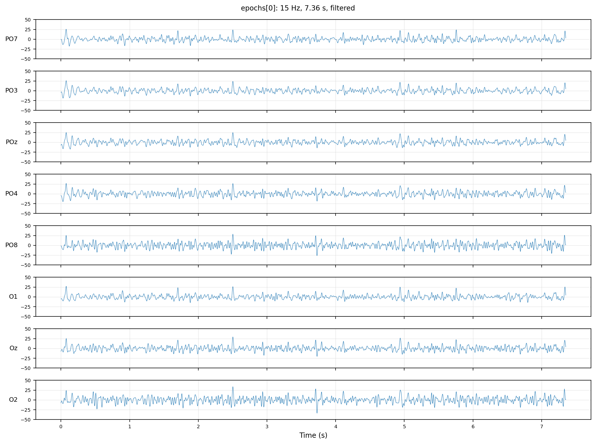
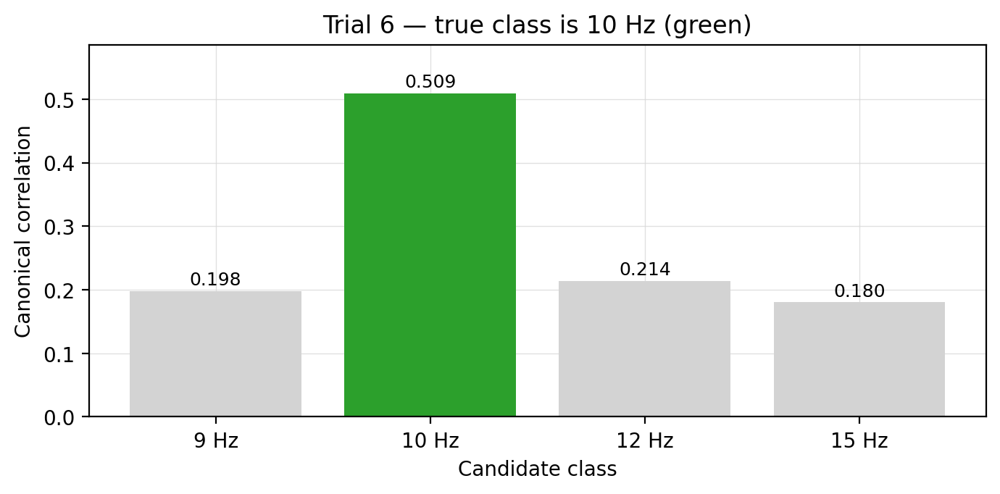
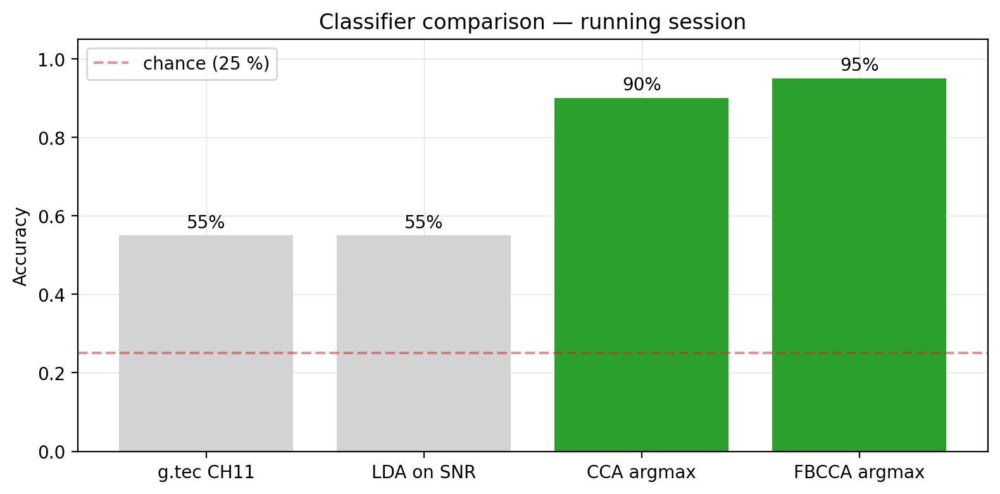
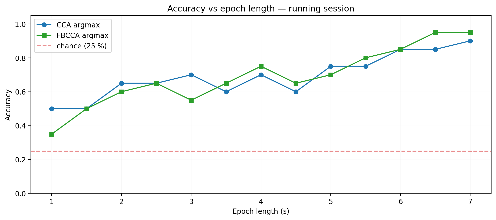

## The core idea

This is raw EEG from someone wearing eight electrodes over the back of their head. Buried in these squiggles is enough information to tell which of four flashing lights they're looking at — without them saying a word. Here's how.

## The phenomenon

When you stare at a light flickering nine times a second, your visual cortex echoes the rhythm — that's the sharp peak at exactly 9 Hz, with a smaller harmonic at 18 Hz. This effect is called **SSVEP** — Steady-State Visual Evoked Potentials. The dataset flickers four LEDs at 9, 10, 12, and 15 Hz, and our job is to read which one the brain is locking onto.

## Clean up the signal

Raw EEG is noisy — heartbeat, mains hum, slow drift. A bandpass filter from roughly 5 to 45 Hz keeps the SSVEP frequencies and throws the rest away. Same trial, before and after.

## Cut into trials

Each LED is on for a few seconds at a time. The recording has a trigger channel, and we use it to slice the signal into one short epoch per LED — these are the chunks the classifier will see.

## Score each candidate frequency

For every epoch we ask a simple question: how strongly does this EEG correlate with a perfect 9 Hz template? With 10? With 12? With 15? The frequency with the highest score wins. The technique is called **CCA** — canonical correlation analysis.

## 95% accuracy

Four-way classification on a real session. Random guessing would give 25 percent. The pre-shipped LDA baseline lands at 55. The CCA pipeline we just built reaches 90, and **filter-bank CCA** — which scores several harmonics together — hits 95 percent. A working brain–computer interface, in a few hundred lines of Python.

## Speed vs. accuracy

And the 95% number isn't fragile. Even with one-second snippets we comfortably beat chance; with six-second windows we're back at 95. The operator gets to dial speed against accuracy depending on the application.
